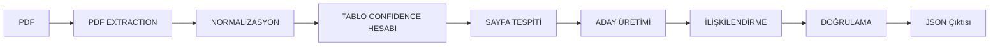

# yapikredi-pdf-extraction

## Yaklaşım Özeti

7 aşamalı bir çözüm kullandım, her aşama belli bir formatta girdi ve çıktı alıyor ve ara aşamalar JSON şeklinde kaydediliyor (artifacts altında).



Deney kolaylığı ve geliştirebilirlik sağlamak için yaklaşım olabildiğince modüler tasarlandı, her aşamanın girdisi ve çıktısı veri formatına uyduğu sürece geliştirilebilir ve değiştirilebilir. 

Aşamaların açıklamaları:
1. **PDF EXTRACTION**:
Öncelikle PDF'ten tablolar, sayfa numaraları, başlıklar ve diğer gerekli bilgiler OCR ve VLM kullanılarak JSON formatında kaydedildi.
2. **NORMALIZASYON**:
Çıkarılan bilgiler normalizasyon aşamasına gönderildi, burada kalemler arası hiyerarşi ve değerlerin parse edilmesi gibi normalizasyondan geçirildi.
3. **TABLO CONFIDENCE HESABI**:
Yapılan iki doküman extraction ile confidence değerleri hesaplandı, hem kıyaslama yaparak hem doküman içi doğrulama ile.
4. **SAYFA TESPITI**:
İçindekiler tablosu ve REGEX kullanılarak hedef sayfalar tespit edildi (verilen notu içeren).
5. **ADAY ÜRETİMİ**:
Notu içeren tüm özet ve not satırları önceki aşamada belirlenen sayfaları kullanarak, bağlamı ile beraber hazırlandı.
6. **İLİŞKİLENDİRME**:
Kurallar, bi-encoder, cross-encoder ve önceden hesaplanmış confidence kullanılarak satırlar arası ilişkiler ve ilişkilerin güvenilebilirliği hesaplandı.
7. **DOĞRULAMA**:
Tüm tablolar yapısal, format ve finansal doğrulamadan geçti.

En sonunda ise tüm istenen bilgiler (doküman bilgileri, tablolar, alakalı bulunan satırlar) incelenmek üzere JSON formatında kaydedildi. 

## Kurulum ve Çalıştırma

Çalıştırmadan önce app/config.py içinde config ayarlanarak hangi özet tablolarının işlenmesi istendiği, hangi notun çıkarılması istendiği, ve girdi PDF'in ismi ayarlanabilir. Değiştirilmezse default olarak sayfa 5, 6, 7 ve not 11 alakaları kurulacaktır.

```bash
chmod +x run.sh
./run.sh
```
PDF extraction aşamasında kullanılan Docling ve DeepSeek-OCR-2 farklı iki environment gerektiği için bunu halleden bir run script yazdım.

## PDF Extraction 

Bu aşamada birkaç farklı yöntem denedim:

1. **Tesseract OCR ve Docling**: Çok fazla rakam hatası ve kelime kayması olduğu için kullanılamazdı
2. **GraniteDocling VLM ve Docling**: Çıktı kalitesi yine çok düşüktü
3. **Qwen2.5 VL**: Tablolarda kayıp çoktu, kullanılamaz düzeyde
4. **Easy OCR ve Docling**: Kaymalar ve hatalar olsa da kabul edilebilir kalitede
5. **DeepSeek OCR 2**: En iyi başarı, ancak tablo formatında sistematik olarak düzeltilebilir kaymalar oldu

Sonuç olarak DeepSeek ve Easy OCR ile devam ettim. DeepSeek en iyi başarı gösterdiği için ana kaynak olarak onu tercih ettim. PDF içi pozisyonel değerler ve doğrulama için ikinci bir çıktı olarak ise Docling'i tercih ettim (Easy OCR tabanı ile)

Not: Tesseract'ın kendi confidence'ı hatalarıyla korelasyon göstermiyordu. Doğru değerlere düşük, yanlış değerlere yüksek confidence verdiği oluyordu, 
bu yüzden OCR katmanının confidence'ını hesaplamaya katmadım.

## Kullanılan Modeller ve Inference Ayarları

Hiçbir model eğitilmedi, hepsi sadece inference. Tüm modeller local hardware üzerinde çalıştırıldı, API kullanımı yok.

**Extraction (Çıkarma Aşaması)**
* **Girdi:** PDF sayfaları tek tek işlenir.
* **DeepSeek-OCR-2 (Birincil Model):** Tüm dipnot referanslarını, ve az çok tüm değerleri doğru okuduğu için tercih edildi.
* **docling + EasyOCR (İkinci Görüş):** Çapraz kontrol sağlamak ve tablolardaki değerlerin indentation sayısını çıkarabilmek için kullanıldı.

**İlişkilendirme Aşaması**
* **Girdi:** Satırın bağlamla zenginleştirilmiş hali (varsa modelin promptuna gömülü şekilde) iletilir.
* **`intfloat/multilingual-e5-base` (Bi-encoder):**
  * **Amaç:** Türkçe destekli bi-encoder performansını test etmek.
  * **İşleyiş:** Satırları tek tek alarak ayrı dense embedding'ler üretir.

* **`BAAI/bge-reranker-v2-m3` (Cross-encoder):**
  * **Amaç:** Türkçe destekli cross-encoder performansını test etmek.
  * **İşleyiş:** Çifti doğrudan girdi olarak alıp -1 ile 1 arasında tek bir alaka skoru üretir.

**Inference sırasında verilen bağlam.**  
Her satır bağlamıyla zenginleştiriliyor:   
Tablo başlığı, etiket kolonunun başlığı, alt kalemler için ana kalem, dipnot referansı ve boş olmayan tüm değerler kolon
başlıklarıyla.

Deney olarak bağlamı zenginleştirmeden, yalnızca kalem etiketi ve varsa ana kaleminin etiketini de girdi olarak vermeyi denedim. 
Kod'da bu candidate modülüne bağlam zenginliğini ayarlayan bir argüman ile ayarlanabiliyor. 

Zengin bağlam örneği:
```
BAĞIMSIZ DENETİMDEN GEÇMİŞ 31 ARALIK 2012 TARİHLİ KONSOLİDE BİLANÇO | ana kalem: Duran Varlıklar | kalem: Yatırım Amaçlı Gayrimenkuller | Bağımsız Denetimden Geçmiş Cari Dönem 31 Aralık 2012: 373.992.222 | Bağımsız Denetimden Geçmiş Gecmiş Dönem 31 Aralık 2011: 423.580.000
```

Az bağlam örneği:
```
ana kalem: Duran Varlıklar | kalem: Yatırım Amaçlı Gayrimenkuller
```

**Uzun doküman ve büyük tabloların parçalanması.**  
İlişki satır seviyesinde olduğu için doğal birim satır + bağlamı, yaklaşık 50 token. Bu yüzden bir chunking yaklaşımı gerekmedi.

**Adayların üretilmesi ve sıralanması.**   
Aday üretimi kural tabanlı: kaynak satırlar (dipnota referans veren) × hedef satırlar (dipnot sayfalarındaki tüm satırlar)

Sıralama için hem semantic hem kural tabanlı hibrit yaklaşım uygulandı, model çıktısı,
kurallar, ve upstream değerleri ile:
```
confidence = 0.55 x model + 0.35 x rules + 0.10 x upstream
```
- **model**: kullanılan scorer'ın çıktısı. Cross-encoder'da çıkan logit
  sigmoid ile [0,1]'e çekiliyor. Bi-encoder'da ise iki bağlam ayrı
  ayrı gömülüp cosine benzerliği [-1,1] den [0,1] çeviriliyor
- **rules**: `value` / `period` / `label` özelliklerinin ağırlıklı toplamı:  
```rules = 0.6 x value + 0.25 x period + 0.15 x label```
  - value (0.60): Herhangi bir kaynak değeri hedef değerlerinden birine eşitse 1.0 değilse 0.0.
  - period (0.25): Eşleşen çift aynı yılı paylaşıyorsa 1.0, farklıysa 0.3, değer eşleşmesi yoksa 0.5. Bir değerin dönemi kolon başlığından veya satırın kendi etiketinden çıkarılıyor.
  - label (0.15): İki etiket arasındaki token bazlı Jaccard benzerliği.
- **upstream**: kaynak ve hedef satırın extraction + normalizasyon
  aşamasından taşıdığı confidence'ın **min**'i. İkisinden düşük olanı
  alınıyor.

**Threshold belirlenmesi.**  
Eşleşmenin detayları `05_linking_candidates.json` altında loglanıyor. Kullanılan modeller için çıkan bu sonuçları inceleyip, threshold'u kabul edilebilir bir minimum tolerans ve değerler arasındaki en büyük düşüşe bakarak seçtim. Sonraki aşama olarak bu otomatize edilebilir.

**Model başarısız olduğunda fallback.**  
Model yüklenemezse veya hata verirse pipeline doğrudan RuleScorer'a düşüp sadece kurallarla eşleme yapıyor. Eşiği geçen aday çıkmadığında ise en iyi adaylar ve puanlarıyla beraber status: "unlinked" olarak kaydediliyor.

---

## Confidence Yöntemi
**Hücre.**
```
hücre confidence = 0.4 x parse + 0.6 x agreement
```
- `parse`: hücre sayı / tire / boşluk olarak çözüldü mü (1.0 veya 0.0)
- `agreement`: ikinci extractor aynı satır için ne okumuş:

| | |
|---|---|
| 1.0 | aynı metin |
| 0.6 | aynı rakamlar, farklı ayırıcı (örneğin 133.123 ve 133,123) |
| 0.5 | diğer extractor bu satırı hiç görmemiş |
| 0.3 | farklı rakamlar |

**Satır.**   
Hücre confidence'larının ortalaması satır ortalaması olarak belirlendi.

**Tablo.**
```
tablo confidence = 0.8 x row confidence + 0.2 x column confidence
```
`column confidence`, bu tablonun kolon isimlerinin diğer extractor'ın aynı tablo için okuduğu isimlerle token örtüşmesidir. Satır sayısı genelde daha çok olduğu için daha çok ağırlık verildi (bir sonraki aşama olarak orana göre ağırlıklandırılabilir)

---

## Tablo Normalizasyonu

Tüm sayısal değerler kurala uygun şekilde parse edildi: parantezler negatif, noktalar binlik ve virgüller ondalık ayırıcı olarak işlendi.

**Ana Kalem / Alt Kalem / Toplam İlişkisi:**
Bu ilişkiyi yalnızca bilanço tabloları için çıkardım:
- Alt kalemler: Metin içindeki - önekiyle doğrudan tespit edildi.
- Girinti (Hiyerarşi): DeepSeek markdown çıktısında girintileri tamamen sildiği için (<td> içinde baştaki boşluklar yok), Docling'in hücre bounding box (l) değerlerini kullandım. Bilançoda bir kalemin girintisi kendinden öncekinden fazlaysa, o kalemin alt kalemi olarak bağlandı.

Tüm alt kalemlerin toplamının ana kaleme tekabül etmesi bekleniyor (bilanço kapsamında)

---

## Doğrulama

| grup | kontrol | ne zaman tetiklenir |
|---|---|---|
| yapısal | `NOTE_PAGE_UNVERIFIED` | içindekiler ve dipnot başlığı farklı sayfa söylüyor |
| format | `VALUE_UNPARSED` | değer hücresi sayı/tire/boşluk olarak çözülmedi |
| format | `CURRENCY_MISSING` | sayfada para birimi yok |
| finansal | `SUBITEM_MISMATCH` | alt kalemler ana kaleme toplanmıyor |
| finansal | `VALUE_NOT_IN_NOTE` | dipnota referans veren özet değer dipnotta bulunmuyor (tam hata olduğu anlamına gelmese de tuttum) |

Her tablo, satır, hücre ve ilişki bir `flags` listesi tutuyor. Buraya geçemediği kontrollerin kodları ve puanı 0.6'nın altındaysa `LOW_CONFIDENCE` ekleniyor.

---

## Yöntem Karşılaştırması

Doğru threshold'lar seçildiğinde her iki yaklaşım da test edilen örneklerde doğru ilişkileri yakaladı.

* **Bi-encoder:** Hem az hem çok bağlam verildiğinde satırlar arası benzerlikleri birbirine çok yakın çıkardı ve adayları ayırt edemedi. Adayların hepsi zaten aynı dipnottaki benzer finansal satırlar olduğu için model tek başına yetersiz kaldı. Sıralamayı doğru yapabilmesini tamamen hibrit taraftaki kurallar sağladı. Bu durum finansal domain için eğitilmiş daha özelleşmiş modellerle aşılabilir.
* **Cross-encoder:** Satır çiftlerini doğrudan kıyaslayabildiği için tek başına da anlamlı bir sıralama ve ayrım oluşturabildi.
* **Kuralların Rolü:** Kurallar iki modele de net fayda sağladı, özellikle bi-encoder tarafında doğru sıralamayı neredeyse tek başına belirledi.

## Hata Analizi

**1. Bi-encoder'ın adayları ayırt edememesi**
* **Aşama:** İlişkilendirme
* **Sorun:** Model 18 aday satırın tamamına 0.930 ile 0.949 arasında puan verdi (sadece 0.019'luk yayılım).
* **Neden:** Adayların hepsi aynı dipnot sayfalarından geldiği için benzer finansal kelimeleri ve ortak tablo başlıklarını paylaşıyor. Bi-encoder iki tarafı bağımsız gömdüğünden bu ortak bağlam vektörü domine etti ve asıl ayırt edici farklar arada kaynadı.
* **Çözüm:** Daha büyük ölçekli veya finansal veriyle eğitilmiş embedding modellerine geçmek.

**2. OCR karakter hatası yüzünden ilişkinin kopması**
* **Aşama:** Extraction / Normalizasyon
* **Sorun:** DeepSeek hücreyi `373.992.222` yerine `373,992.222` olarak okudu.
* **Etkisi:** Virgül-nokta karmaşası yüzünden değer düzgün parse edilemedi ve sayı eşleşmesi yapılamadı. Kural puanı tabana (0.125) düştüğü için `Yatırım Amaçlı Gayrimenkuller` ile `net defter değeri` arasındaki ilişki kurulamadı. Hücre `LOW_CONFIDENCE` olarak işaretlendi.
* **Çözüm:** Farklı OCR motorları, farklı VLM'ler veya instruction-tuned büyük VLLM alternatifleri denenerek extraction kalitesi artırılabilir.

**3. İkinci extractor'ın (Docling) tireleri ve bazı değerleri kaçırması**
* **Aşama:** Extraction 
* **Sorun:** Docling tablolardaki `-` (tire) işaretlerini doğrudan boşluk olarak okudu. Ayrıca özet tablosundaki `Borç Karşılıkları` satırında geçen `504.851` gibi değerleri kaçırdı.
* **Etkisi:** DeepSeek tireyi doğru yakalasa bile Docling boş gördüğü için `agreement` puanı düştü ve `LOW_CONFIDENCE` olarak flaglendi.
* **Çözüm:** 2. Problem ile aynı.

## Çıktı Şeması
Tüm pipeline çıktısı tek bir `08_output.json` dosyası olarak kaydedilir. Veri modeli doküman üst bilgileri, tablolar, satırlar, ilişkiler ve doğrulama bulgularını tek bir yerde toplayan ilişkisel ve düz (flat) bir yapıda tasarlandı.

`08_output.json`:

```json
{
  "document":     { "company": "…", "periods": [2012, 2011], "currency": "Türk Lirası (TL)" },
  "config":       { "pages": [5, 6, 7], "note": 11 },
  "note":         { "note": 11, "pages": [53, 54], "verified": true, "offset": 4 },
  "tables":       [ { "id": "p005.t0", "title": "…", "confidence": …, "flags": [] } ],  
  "summary_rows": [ … ],
  "note_rows":    [ … ],
  "relations":    [ … ],
  "validation":   { "issues": [ … ], "counts": { … } }
}
```

**Veri Modeli Tercihleri**

* **Düz (Flat) Satır Yapısı:** Satırlar tabloların içine gömülmek yerine `summary_rows` ve `note_rows` olarak düz listelerde tutuldu. Eşleşmeler `p{sayfa}.t{tablo}.r{satır}` formatındaki ID'ler üzerinden bağlandı.
* **Hücre Seviyesinde Takip:** Değerler sadece metin olarak bırakılmadı, `raw`, `parsed`, `period` ve hücre bazlı `confidence` ayrı tutuldu. Sorunlu hücreler `flags` ile işaretlendi.
* **Skor Kırılımları:** `relations` altında sadece nihai skor değil, kararı oluşturan `model`, `rules` ve `upstream` puanları ayrı ayrı saklandı.

### Artifact'lar

| dosya | aşama |
|---|---|
| `00_pages.json` | extraction, docling + EasyOCR (ikinci görüş) |
| `01_pages.json` | extraction, DeepSeek-OCR (birincil) |
| `02_tables.json` | normalizasyon |
| `03_confidence.json` | hücre / satır / tablo confidence |
| `04_candidates.json` | aday çiftleri + bağlam |
| `05_relations.json` | ilişkiler, her scorer için ayrı. |
| `05_linking_candidates.json` | puanlanan tüm adaylar logu |
| `06_validation.json` | doğrulama bulguları |
| `07_final_table.json` | doğrulama bulguları eklenmiş tablolar, yani son hali |
| `08_output.json` | **Tüm gerekli bilgileri içeren son çıktı** |

---

## Bilinen Eksikler ve Geliştirilebilecekler

* **Gelir Tablosu Aritmetiği:** Gelir tablosu ağaç yapısında değil akan bir yapıda olduğu için işaret ve operatör semantiği gerektiriyor. Aritmetik doğrulama şu an sadece bilançoda çalışıyor, gelir tablosu için ayrı bir kontrol akışı eklenebilir.
* **Yatay Tablolar:** 12 numaralı dipnot gibi dikey sayfaya yatay basılmış tablolar çıkarıcılar tarafından bozuk okunuyor. Tablo yönünü baştan algılayan bir dedektör eklenerek çözülebilir.
* **Birleşik Başlıklar:** DeepSeek çıktısını toparlamak için `colspan` yok sayıldı, bu da gerçekten birleşik olan başlıkların yapısını bozdu. Başlık yapısını koruyan daha esnek bir parsing mantığı kurulabilir.
* **İlişki Tipleri:** Eşleşmelerin tamamı tipsiz (`relates_to`) kaydedildi. Tek bir kaynağa birden fazla hedef bağlandığında aradaki anlamsal fark (kapanış bakiyesi, net defter değeri vb.) çıktıda ayrışmıyor. Bu ayrım bir LLM katmanı veya detaylı kurallarla tiplere dönüştürülebilir.